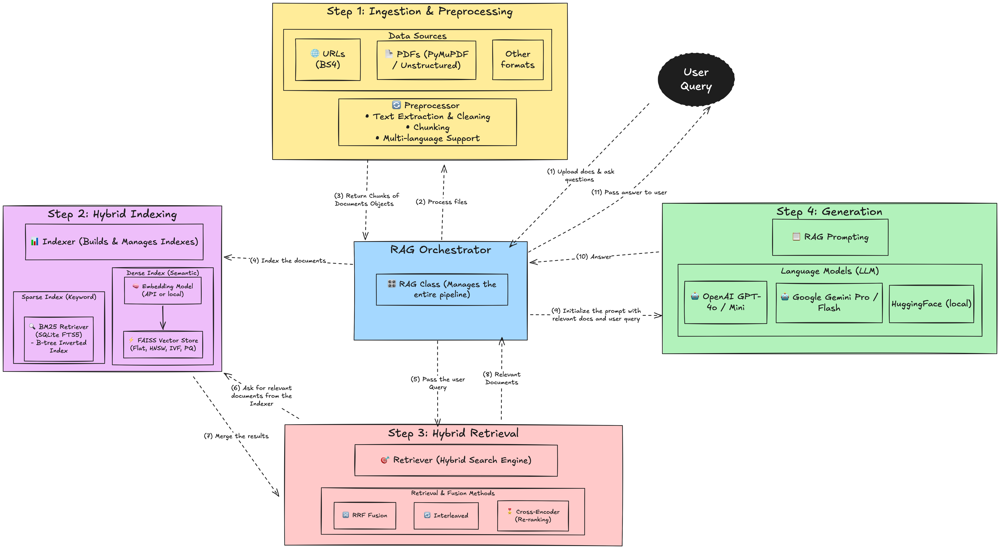

# RAG (Retrieval-Augmented Generation) System

A comprehensive RAG system that combines document preprocessing, hybrid retrieval (sparse + dense), and language model generation to provide accurate, context-aware answers to user queries.




## Features

- **Multi-source Document Processing**: Support for URLs, PDFs (with OCR), and custom documents
- **Multi-language Support**: Support for multiple languages (English, Arabic)
- **Sparse Retrieval**: BM25 with fast B-tree inverted index (SQLite FTS5) 
- **Dense Retrieval**: FAISS with various index types (Flat, HNSW, IVF, PQ, LSH)
- **Hybrid Retrieval**: Combines sparse (BM25) and dense (FAISS) search for optimal results
- **Multiple LLM Providers**: Support for OpenAI (GPT) and Google (Gemini) models
- **Advanced Retrieval Methods**: RRF, interleaved merging, cross-encoder, multi-query, and more
- **Persistent Storage**: Save and load indexes for reuse
- **Comprehensive Logging**: Detailed logging for debugging and monitoring

## File Structure

```
search_app/
├── rag.py                      # Main RAG orchestrator class
├── preprocessor.py             # Document extraction and chunking
├── indexer.py                  # Sparse (BM25) + Dense (FAISS) indexing
├── retriever.py                # Hybrid retrieval with RRF, interleaved methods
├── prompts.py                  # RAG prompt templates
├── example_rag_usage.py        # Usage examples and demos
├── README.md                   # Documentation and setup guide
├── indexes/                    # Directory for saved indexes
│   ├── index.faiss            # Dense vector index
│   ├── index.pkl              # Index metadata
│   └── bm25.sqlite            # Sparse FTS5 index
└── requirements.txt            # Python dependencies (to be created)
```


## Installation

### Requirements

```bash
pip install langchain
pip install langchain-community
pip install langchain-openai
pip install langchain-google-genai
pip install faiss-cpu  # or faiss-gpu for GPU support
pip install pymupdf
pip install beautifulsoup4
pip install sqlite3
```

### Environment Variables

Set up your API keys:

```bash
export OPENAI_API_KEY="your-openai-api-key"
export GOOGLE_API_KEY="your-google-api-key"  
```

## Quick Start

```python
from rag import RAG

# Initialize RAG system
rag = RAG(
    llm_model="gpt-4o-mini",
    embedding_model="text-embedding-3-large",
    k=5  # Number of documents to retrieve
)

# Add documents from URLs
urls = ["https://example.com/article1", "https://example.com/article2"]
rag.add_documents_from_urls(urls)

# Add documents from PDFs
pdf_paths = ["document1.pdf", "document2.pdf"]
rag.add_documents_from_pdfs(pdf_paths)

# Query the system
answer = rag.query("What is machine learning?")
print(answer)

# Get detailed results with context
result = rag.query("How does AI work?", return_context=True)
print(f"Answer: {result['answer']}")
print(f"Context: {result['context']}")
print(f"Documents used: {result['num_documents']}")

# Save index for reuse
rag.save_index()

# Clean up
rag.cleanup()
```

## Configuration Options

### LLM Models

```python
# OpenAI models
rag = RAG(llm_model="gpt-4o")          # GPT-4 Omni
rag = RAG(llm_model="gpt-4o-mini")     # GPT-4 Omni Mini
rag = RAG(llm_model="gpt-3.5-turbo")   # GPT-3.5 Turbo

# Google Gemini models
rag = RAG(llm_model="gemini-1.5-pro")   # Gemini 1.5 Pro
rag = RAG(llm_model="gemini-1.5-flash") # Gemini 1.5 Flash
```

### Embedding Models

```python
# OpenAI embeddings
rag = RAG(embedding_model="text-embedding-3-large")
rag = RAG(embedding_model="text-embedding-3-small")

# Google embeddings
rag = RAG(embedding_model="models/embedding-001")
```

### Dense Index Types

```python
# Exact search (good for small datasets)
rag = RAG(dense_index_type="flat_l2")    # Euclidean distance
rag = RAG(dense_index_type="flat_ip")    # Cosine similarity

# Approximate search (good for large datasets)
rag = RAG(
    dense_index_type="hnsw",
    dense_index_params={
        "M": 32,               # Number of connections
        "efConstruction": 200, # Build-time search depth
        "efSearch": 100        # Query-time search depth
    }
)

# Quantized indexes (memory efficient)
rag = RAG(
    dense_index_type="ivf_pq",
    dense_index_params={
        "nlist": 100,  # Number of clusters
        "m": 8,        # Subquantizers
        "nbits": 8     # Bits per subquantizer
    }
)
```

### Retrieval Methods

```python
# Reciprocal Rank Fusion (default)
rag = RAG(retrieval_method="rrf", sparse_weight=0.5)

# Interleaved merging
rag = RAG(retrieval_method="interleaved")

# Sparse only (BM25)
rag = RAG(retrieval_method="sparse_only")

# Dense only (vector search)
rag = RAG(retrieval_method="dense_only")
```

### Preprocessing Options

```python
rag = RAG(
    preprocessor_options={
        "chunk_size": 1000,      # Size of text chunks
        "chunk_overlap": 200,    # Overlap between chunks
        "clean_text": True       # Apply text cleaning
    }
)
```

## Advanced Usage

### Custom Document Processing

```python
from langchain_core.documents import Document

# Create custom documents
docs = [
    Document(
        page_content="Your custom text content here...",
        metadata={"source": "custom", "category": "AI"}
    )
]

# Add to RAG system
rag.add_documents(docs)
```

### PDF Processing with OCR

```python
# Process PDFs with OCR for scanned documents
rag.add_documents_from_pdfs(
    pdf_paths=["scanned_document.pdf"],
    use_ocr=True  # Enable OCR
)
```

### Index Management

```python
# Get index statistics
stats = rag.get_index_stats()
print(f"Sparse documents: {stats['sparse_documents']}")
print(f"Dense documents: {stats['dense_documents']}")

# Save index to disk
rag.save_index()

# Load existing index
rag.load_index()

# Clean up index files
rag.cleanup()
```

### Retrieval Only

```python
# Just retrieve documents without generating answers
docs = rag.retrieve_documents("your query here")
for doc in docs:
    print(f"Source: {doc.metadata.get('source')}")
    print(f"Content: {doc.page_content[:100]}...")
```

## Examples

Run the example script to see various usage patterns:

```bash
python example_rag_usage.py
```

This script demonstrates:
- Basic usage with URLs
- Advanced configuration options
- Google Gemini integration
- PDF processing
- Comparison of retrieval methods

## Performance Tips

### For Large Datasets

1. **Use HNSW index** for dense retrieval:
   ```python
   rag = RAG(dense_index_type="hnsw", dense_index_params={"M": 32})
   ```

2. **Adjust chunk size** based on your content:
   ```python
   rag = RAG(preprocessor_options={"chunk_size": 800, "chunk_overlap": 100})
   ```

3. **Use quantized indexes** for memory efficiency:
   ```python
   rag = RAG(dense_index_type="ivf_pq")
   ```

### For Speed

1. **Use smaller embedding models**:
   ```python
   rag = RAG(embedding_model="text-embedding-3-small")
   ```

2. **Reduce retrieval count**:
   ```python
   rag = RAG(k=3)  # Retrieve fewer documents
   ```

3. **Use faster LLM models**:
   ```python
   rag = RAG(llm_model="gpt-4o-mini")
   ```

## Troubleshooting

### Logging

The system provides comprehensive logging. To adjust log level:

```python
import logging
logging.getLogger("rag").setLevel(logging.DEBUG)
```

## TODO List

| Feature | Status |
|---------|--------|
| LangSmith Integration for monitoring | ☐ |
| Cross-Encoder Re-ranking | ☐ |
| HyDE Implementation | ☐ |
| Docling PDF Processing | ☐ |
| FTS5 query tokens should be ORed | ☐ |
| Caching Embeddings for unit tests | ☐ |
| Memory Optimization (multithreading + batching) | ☐ |
| Web Interface with Streamlit | ☐ |
| Performance Tests | ☐ |
| Evaluation Datasets | ☐ |
| Docker Containerization | ☐ |

